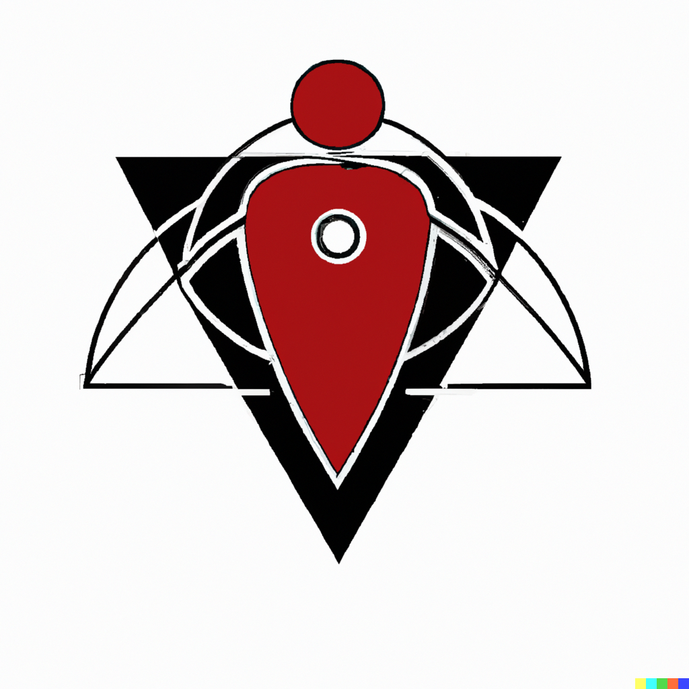

# Prompt-Joe
Türkçe Prompt Mühendisliği Notları 

-----------------------------------------

#### Logo: 

##### Logoyu oluşturan prompt:

"A logo for an AI character, centered, white background"

##### Referans: 

[Reddit comment](https://www.reddit.com/r/midjourney/comments/wgbupb/comment/ipkar56/?utm_source=share&utm_medium=web2x&context=3) 

##### Logoyu oluşturan model:

Dall-E 2

-----------------------------------------

### Güzel Promptlar ve Sonuçları

[Güzel Promptlar](güzel_promptlar.md)

-----------------------------------------

### Terimler

#### Prompt engineering
Doğal dil işleme modellerinin bazıları girdi olarak verilen yazı ile çalışırlar ve bu yazıyı kullanarak görevleri yerine getirirler. Elbette, bu girdiyi kullandıkları için performansları bu yazının kalitesine bağlıdır. İşte bu yazıyı hazırlamaya prompt engineering denir.  

-----------------------------------------

### İlgili makaleler
- Kojima, Takeshi, et al. "Large Language Models are Zero-Shot Reasoners." arXiv preprint arXiv:2205.11916 (2022).

-----------------------------------------

### Katkıda bulunanlar

Kişilik ekleme fikri:
Emir Yiğit Yılmaz  

-----------------------------------------

### Katkıda bulunmak mı istiyorsunuz? 
Bulunun :) Hatta çok sevinirim. Birlikte Türkçe yapay zeka kaynaklarını geliştirelim.

Yeni arkadaşlar için: 
1. İlk önce forklayın. 
2. Eklemek istediğiniz özellik için yeni bir branch oluşturun ve branch'in adı da açıklayıcı olsun. 
3. Daha sonra pull request gönderin. 

-----------------------------------------

### İlgili diğer Github repoları 
- https://github.com/sw-yx/prompt-eng
- https://github.com/thunlp/OpenPrompt
- https://github.com/thunlp/PromptPapers

-----------------------------------------

### İlgili Websiteleri
- https://beta.dreamstudio.ai/prompt-guide
