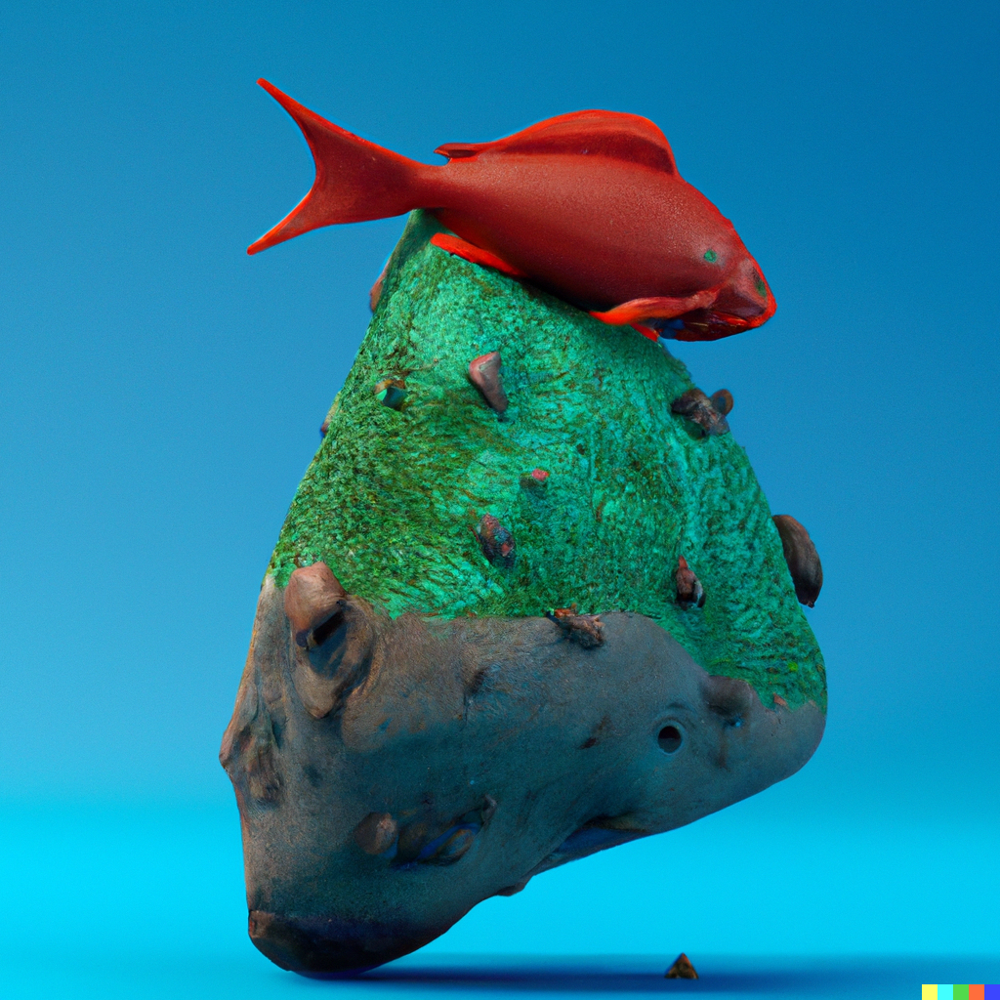

# Prompt-Joe
Türkçe Prompt Mühendisliği Notları 

-----------------------------------------

#### Logo: 

##### Logoyu oluşturan prompt:

"A logo for an AI character, centered, white background"

##### Referans: 

[Reddit comment](https://www.reddit.com/r/midjourney/comments/wgbupb/comment/ipkar56/?utm_source=share&utm_medium=web2x&context=3) 

##### Logoyu oluşturan model:

Dall-E 2

-----------------------------------------

### Güzel Promptlar ve Sonuçları

[Güzel Promptlar](güzel_promptlar.md)

-----------------------------------------

### Terimler

#### Prompt engineering
Doğal dil işleme modellerinin bazıları girdi olarak verilen yazı ile çalışırlar ve bu yazıyı kullanarak görevleri yerine getirirler. Elbette, bu girdiyi kullandıkları için performansları bu yazının kalitesine bağlıdır. İşte bu yazıyı hazırlamaya prompt engineering denir.  

#### Zero shot learning 
Makine öğrenmesinde bir modelin belirli bir görev için eğitilmemesine rağmen o belirli görevi yapabilmesine denir. Biraz daha detay verirsek eğitim sürecinde olmayan görevleri test zamanında yapabilmeye olanak sağlar. Örnek, bir model düşünün saat markalarını resimlerden sınıflandırabiliyor. Eğitim süresince sadece Patek Phillipe, Rolex ve Omega ile eğitmişsiniz. Fakat test süresince o bu modellerin dışında JLC'yi de tanıyabiliyor. 

#### Few shot learning 
Zero shot learningin aynısı yalnızca 1-2 örnek ile görevi yapabiliyor. 

#### LLM (Large Language Model)
Makale okurken sıkça karşılaştığımız terimdir. Büyük dil modelleri demektir. Kendi yorumum şu şekilde o kadar büyük modeller ve o kadar uzun süre eğitiliyorlar ki normal bir kişinin veya küçük bir şirketin bütçesinin çok üzerlerine mal oluyorlar. Tabi bu kadar eğitilmelerinden gelen bazı zero shot ve one shot yetenekleri oluyor. Bir kere eğitildikten sonra çalıştırması (inference) görece kolay. 

-----------------------------------------

### İlgili makaleler
- Kojima, Takeshi, et al. "Large Language Models are Zero-Shot Reasoners." arXiv preprint arXiv:2205.11916 (2022).
- Yongchao, Zhou et al. "Large Language Models Are Human-Level Prompt Engineers" arXiv preprint arXiv:2211.01910 (2022).
Bu ikinci makale ilginç gerçekten. Bu benim de üstüne uğraştığım otomatik prompt oluşturma üzerine. Input-Output ikilileri vererek prompt oluşturmayı öğretiyorlar. Fakat kendi çalışmalarımdan da gördüğüm üzere LLM'lerin karmaşık taskları çözmede bariz zayıflıkları var. Burada gösterilen örnekler oldukça basit ama çalışıyor. Güzel kod ve colab oluşturmuşlar. Kaliteli iş. 

-----------------------------------------

### Resim oluşturma promptları - Dalle, Stable Diffusion gibi

baştan şunu söyleyeyim. Prompt yazmanın bilinen optimal yolu yok. Suboptimal bir sürü çözüm var. O yüzden deneme yapmalısınız. Değişik promptları birleştirmekten korkmayın. 

1. Öncelikle neyin resmini istediğinize karar vermelisiniz. Bu modeller objeler arası bağlantıları iyi kurabiliyorlar o yüzden at süren astronot falan gibi garip şeyler istemekten çekinmeyin. Örnek "a rock on a fish". 

2. Daha sonra bunu nasıl bir senaryoda istiyorsunuz. Mesela bu fotorealistik bir fotoğraf mı olacak? O zaman "a photo of a rock on a fish". Ya da işte a 3D render halini istiyorsanız "a 3D render of a rock on a fish".

3. Objeleri tanımlayın. İşte kaya mesela kırmızı olsun. Balık da yeşil. "a 3D render of a red rock on a green fish".

4. Arka planı tanımlayın. Balık olduğu için mesela mavi diyelim. "a 3D render of a red rock on a green fish on a blue background".

5. Artist veya stil tanımlayın. Ben pek maalesef iyi bilmiyorum ama bunu istediğiniz bir artistten çizdirtebilirsiniz. "a 3D render of a red rock on a green fish on a blue background by Salvador Dali" gibi. 

6. Bazı insanlar ünlü sitelerde trending olduğunu yazdıklarında güzel sonuç aldıklarını söylemişler. Mesela artstation diye bir site var. Sona onu ekleyebilirsiniz. Burada tavsiyem realistik bir foto yaparken foto sitelerini yazmanız. Çizim yaparken çizim. "a 3D render of a red rock on a green fish on a blue background by Salvador Dali, trending on Artstation". Ama bu anlamsız olmaya başladı işte. Çünkü 3D render istiyoruz, ona uygun site biliyorsanız onu yazın.

7. En önemlisi her şeyi karıştırın ve tekrar deneyin. Bu söylediklerimin hepsini virgülden sonra da koyabilirsiniz. Örneğin, "a 3D render of a red rock on a green fish, on ablue background, Salvador Dali style, trending on Artstation" gibi. İnsanlar satırlarca prompt üretiyorlar. Denemekten korkmayın.

Sonuç: 

Oluşturan prompt: 

a 3D render of a red rock on a green fish on a blue background by Salvador Dali, trending on Artstation

Problem:

Gördüğünüz gibi objelerin renklerini iyi anlayamamış. Demek ki birşeyleri değiştirmemiz gerekiyor, artık orası sizin denemelerinize kalıyor.

-----------------------------------------

### Katkıda bulunanlar

Kişilik ekleme fikri:
Emir Yiğit Yılmaz  

-----------------------------------------

### Katkıda bulunmak mı istiyorsunuz? 
Bulunun :) Hatta çok sevinirim. Birlikte Türkçe yapay zeka kaynaklarını geliştirelim.

Yeni arkadaşlar için: 
1. İlk önce forklayın. 
2. Eklemek istediğiniz özellik için yeni bir branch oluşturun ve branch'in adı da açıklayıcı olsun.
3. Daha sonra pull request gönderin. 

-----------------------------------------

### İlgili diğer Github repoları 
- https://github.com/sw-yx/prompt-eng
- https://github.com/thunlp/OpenPrompt
- https://github.com/thunlp/PromptPapers
- https://github.com/poloclub/diffusiondb

-----------------------------------------

### İlgili Websiteleri
- https://beta.dreamstudio.ai/prompt-guide
- https://www.inovex.de/de/blog/prompt-engineering-guide/
- https://lexica.art/
- https://huggingface.co/spaces/Gustavosta/MagicPrompt-Stable-Diffusion # GPT 2 lexica art üzerinde prompt üretmek için eğitilmiş 
- https://huggingface.co/datasets/poloclub/diffusiondb # Stable Diffusion prompt ve resim ikilileri ve parametreleri
- https://www.youtube.com/watch?v=bT8e1EV5-ic - Two Minute Papers'ın Stable Diffusion ve ona yazılan prompotlar hakkındaki güzel videosu
