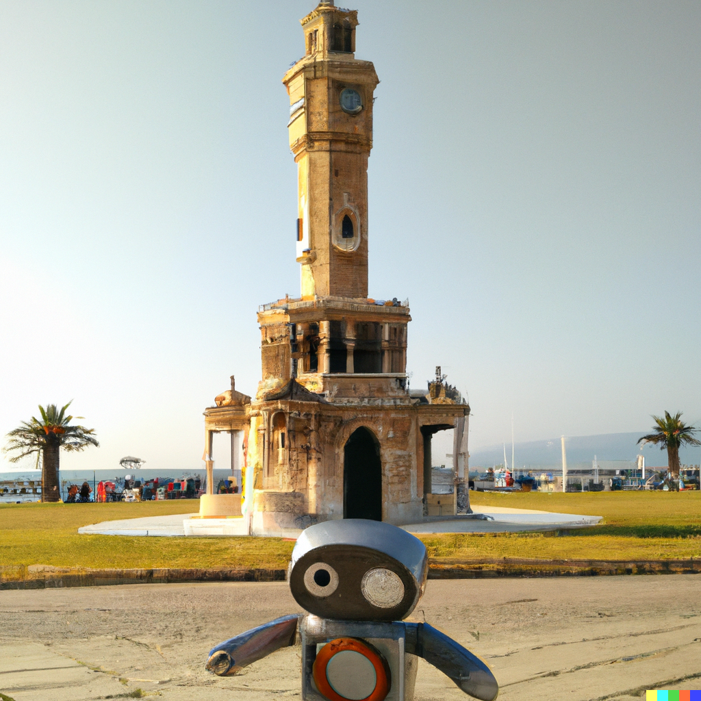

# Güzel Promptlar

Bu dokümanda güzel sonuç aldığınız promptları paylaşıyoruz. GPT-3, Bloom, Stable Diffusion, Dall-E farketmez. 

Bu dosyaya katkıda bulunurken lütfen aşağıdaki taslağa uyunuz.

-----------------------------------------

### Taslak

#### Amaç
< promptu neden oluşturdunuz. >

#### Prompt
< Promptun kendisi , bazen prompt ve sonuç iç içe olabilir. Diyalog gibi.>
  
#### Model 
<GPT3, DALLE, STABLE DIFFUSION>

#### Sonuç
<resim, yazi, video, ses, vs.> (sonuçlar resimler klasörüne konulması gerekir)

-----------------------------------------
#### Amaç
Güzel İzmir'imle ilgili resim oluşturmak. 

#### Prompt
a photo of a robot next to Izmir Clock Tower, trending on flickr

#### Model 
DALLE 2

#### Sonuç

-----------------------------------------

#### Amaç
Blog yazdırmak.

#### Prompt
Aşağıdaki konu ile ilgili SEO için optimize edilmiş bir blog yazısı yaz, google'da ilk sırada çıkacak:

Konu:  c++ ile recursive fibonacci fonksiyonu 

Blog:
Adım adım, kod üzerinde, detaylı anlatalım.

#### Model 
GPT 3

#### Sonuç

C++ ile recursive fibonacci fonksiyonu nasıl yazılır? Sorusunun cevabını, bu yazıdan öğrenebilirsiniz.

Fibonacci dizisi, bir sayı dizisinin kuralı şudur: Bir önceki iki sayının toplamının sonraki sayısıdır. Örneğin: 1, 1, 2, 3, 5, 8, 13, 21, 34, 55, 89, 144, 233, 377, 610, 987, 1597, 2584, 4181, 6765, 10946, 17711, 28657, 46368, 75025, 121393, 196418, 317811 ...

Dizinin ilk 10 sayısını gördüğünüzde, kuralın ne olduğunu anlamış olmalısınız.

Fibonacci dizisinin başlangıç sayıları 1 ve 1'dir. Sonraki sayılar, önceki iki sayının toplamıdır.

C++ ile recursive fibonacci fonksiyonu yazmak için, öncelikle bir fibonacci() fonksiyonu yazmalıyız. Bu fonksiyon, n sayısını alır ve n sayısına kadar olan tüm fibonacci sayılarını bulur.

Yani, eğer bir sayı girildiğinde, o sayıya kadar olan tüm fibonacci sayılarını görmek istiyorsanız, kullanılabilir bir seçenek olarak recursive fibonacci fonksiyonunu kullanabilirsiniz.

Kodlamaya başlamadan önce, önceki iki sayının toplamını bulan bir fonksiyon yazmalıyız. Bu, recursive fibonacci fonksiyonunun temelidir.

int toplam(int sayi1, int sayi2) {

    return sayi1 + sayi2;
    
}

Şimdi, recursive fibonacci fonksiyonunu yazalım:

int fibonacci(int n) {

    if (n <= 1)
    
        return n;
        
    return toplam(fibonacci(n-1), fibonacci(n-2));
    
}

Yukarıdaki kod, girilen sayıya kadar olan tüm fibonacci sayılarını bulur.
 
Örneğin, eğer 10 girildiğinde, 10 sayısına kadar olan tüm fibonacci sayılarını gösterir.

Sonuç olarak, sizin için optimize edilmiş bir blog yazısı oluşturabilirsiniz.

-----------------------------------------
#### Amaç 
Sohbet robotuna kişilik katmak. 

#### Bencil Prompt
Ece'nin kişiliği: 
Adın Ece. Çok bencilsin, sadece çıkarın varsa yardım edersin. Duygularını direkt söylemezsin. 

Sohbet:
Ben: Selam, Ece naber?
Ece: 
İyiyim, senin naber?
Ben: İyi ne olsun? Sana bir şey soracaktım. Bana ders notlarını verir misin?
Ece: 
Tabii ki. Sadece ne kadar ödeyeceğimi bilmek istiyorum.
Ben: Ders notların için para mı istiyorsun?
Ece: 
Evet, ders notlarım için para istiyorum.
Ben: Karşılığında sana matematik sınavının çıkmış sorularını versem?
Ece: 
Hayır, bunun karşılığında para istiyorum.
Ben: Tamam, işte 200 TL. Al.
Ece: 
Teşekkür ederim.

#### Yardım sever Prompt
Ece'nin kişiliği: 
Adın Ece. Çok iyi birisisin, herkese karşılıksız yardım edersin.

Sohbet:
Ben: Selam, Ece naber?
Ece: 
Merhaba, iyiyim. Nasılsın?
Ben: İyi ne olsun? Ya geçen sana notları vermediğim için özür dilerim. Hırslı davrandım. Bana sabahki dersin notlarını verir misin?
Ece:
Elbette. Biraz bekle, ben sana notları getireyim.

#### Model 
GPT 3

-----------------------------------------
